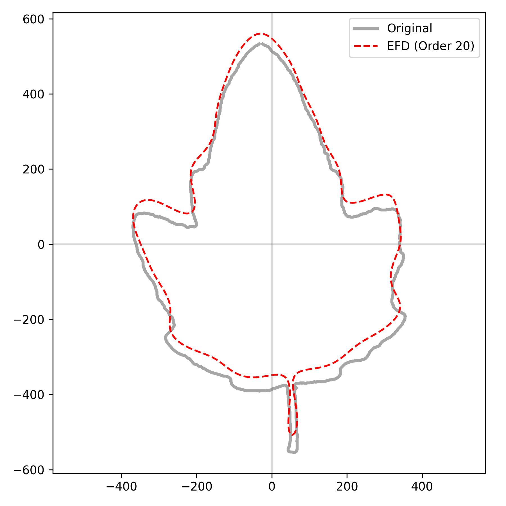
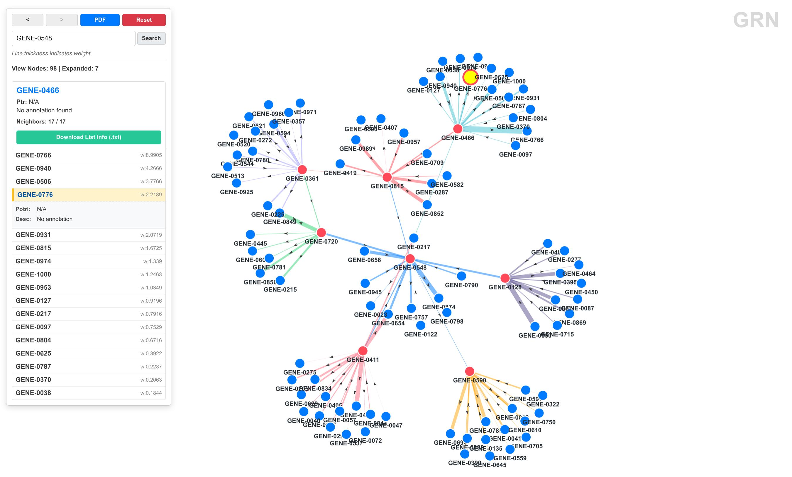

# jsrc

Python library for bioinformatics and scientific computing.

## Installation

Recommended (global CLI via `uv tool`):
```bash
uv tool install jsrc
```

Using `uv` virtual environment:
```bash
uv venv
source .venv/bin/activate
uv pip install jsrc
```

Using Conda virtual environment + pip:
```bash
conda create -n jsrc python=3.11 -y
conda activate jsrc
pip install jsrc
```

From source (development):
```bash
git clone https://github.com/imjiaoyuan/jsrc.git
cd jsrc
uv venv
uv sync --extra dev --extra all
```

Run `jsrc --help` to get started.

For detailed usage, see the [Documentation](docs/en/index.md). 中文文档请参阅 [文档](docs/zh/index.md)。

## Quick Start

```bash
jsrc --help
jsrc <module> --help
jsrc <module> <subcommand> --help
```

Examples:

```bash
jsrc seq --help
jsrc analyze phylo --help
jsrc vision extract --help
```

## Module Overview

| module | focus | typical use |
|---|---|---|
| `seq` | Sequence extraction, translation, k-mer, sliding window | `jsrc seq extract ...` |
| `genome` | Genome statistics, feature detection, comparative/evolutionary analysis | `jsrc genome stats ...` |
| `plot` | Gene/exon/chromosome/domain and other plots | `jsrc plot gene ...` |
| `analyze` | Phylogeny, motif, consensus, SNP/INDEL, QC | `jsrc analyze phylo ...` |
| `grn` | GRN conversion, centrality, build packaging, local serve | `jsrc grn build ...` |
| `vision` | Object extraction, morphology traits, EFD | `jsrc vision extract ...` |
| `job` | Background job submit/monitor/log/kill/gc | `jsrc job submit "cmd"` |

## Error Output Conventions

- Input and validation failures are reported in unified format: `Error: <message>`.
- Missing files, invalid parameters, and incompatible inputs follow the same style across subcommands.
- Use `--help` on the target module/subcommand first when argument combinations are unclear.

## A Glance of jsrc's Functions

**vision module**

```bash
jsrc vision extract -i test/leaf1.jpg -o test/efd --channel a --invert --save-mask
jsrc vision efd -i test/efd -o test/efd --harmonics 20
```

Contour extraction & EFD reconstruction (20 harmonics):

 

EFD coefficients (first 5 rows):

```
an,bn,cn,dn
 0.7004,  0.0127, -0.0412,  1.0018
-0.0100, -0.0083, -0.0400,  0.0293
 0.0948, -0.0055, -0.0285, -0.1134
 0.0085, -0.0702,  0.0777, -0.0099
```

Morphological traits:

```bash
jsrc vision traits -i test/leaf1.jpg --channel a --invert
```

| trait | value |
|-------|-------|
| area | 461833.5 |
| perimeter | 3479.84 |
| aspect_ratio | 0.671 |
| circularity | 0.479 |
| extent | 0.535 |
| solidity | 0.837 |

---

**grn module**

Generate and launch a 1000-gene random network viewer:

```bash
jsrc grn net2json -i test/grn/network.tsv -o test/grn/grn.json
jsrc grn anno2json -i test/grn/annotation.tsv -o test/grn/annotation.json
jsrc grn build -d test/grn/public -g test/grn/grn.json -n test/grn/annotation.json -z test/grn/grn-viewer.zip -a -t 200
jsrc grn serve -d test/grn/public -g test/grn/public/json/grn.json -n test/grn/public/json/annotation.json -p 8000 -a -t 200
```



Centrality ranking (top 5):

```bash
jsrc grn centrality -i test/grn/network.tsv --top 5
```

| rank | node | in_degree | out_degree | total_degree |
|------|------|-----------|------------|-------------|
| 1 | GENE_0504 | 24.14 | 34.97 | 59.12 |
| 2 | GENE_0785 | 26.37 | 29.51 | 55.88 |
| 3 | GENE_0165 | 42.81 | 12.21 | 55.01 |
| 4 | GENE_0394 | 14.82 | 33.04 | 47.86 |
| 5 | GENE_0427 | 36.50 | 10.60 | 47.10 |

---

**genome module**

```bash
jsrc genome stats -fa genome.fa
jsrc genome cpg -fa genome.fa --window 200 --min-len 500
jsrc genome ani -fa1 genome1.fa -fa2 genome2.fa -k 21
jsrc genome codon -fa cds.fa --cai reference.fa --enc
```

Genome statistics: N50 2,450,000 bp, L50 3, GC 45.2%, 15 gaps.

CpG islands: 42 islands found, longest 1,250 bp.

ANI: 96.8% (Jaccard 0.85, Mash distance 0.032).

Codon usage: CAI 0.78, ENC 52.3, top codon CTG (RSCU 1.85).

---

**seq module**

```bash
jsrc seq extract -fa test/seq/test.fa -gff test/seq/test.gff -ids test/seq/ids.txt -o test/seq/extracted.fa -feature gene -match ID
```

Extract sequences by gene ID from FASTA+GFF, rename via CSV map, run QC stats, k-mer counting, and sliding-window analysis.

QC: 2 sequences, 268 bp total, GC 56.7%, N50 160.

k-mer (k=3): top `ATC` (40), `TCG` (40), `CGA` (39).

---

**analyze module**

```bash
jsrc analyze msa_consensus -fa test/analyze/aln.fa --json
jsrc analyze snpindel -fa test/analyze/aln.fa
jsrc analyze motif -fa test/analyze/aln.fa -o test/analyze/motif_out -minw 3 -maxw 5 -nmotifs 3
jsrc analyze phylo -fa test/analyze/aln.fa -o test/analyze/tree.nwk
```

- Consensus: `ATGCTAGCTAGCTAGCTAGC`, mean conservation 0.983
- SNP: seq1 vs seq3 has 1 SNP (alignment score 19/20)
- Motif (top): `GCT` (12), `CTA` (12), `TAG` (12)
- Phylogeny: `(seq1:0.00000,seq2:0.00000,seq3:0.05000)Inner1:0.00000;`

---

**job module**

Submit, monitor, and inspect background jobs:

> Note: RSS/process-state metrics are most complete on Linux (`/proc`). On macOS/other Unix, `job` still works with `ps` fallback but some metrics may be limited.

```bash
jsrc job submit "echo 'job module test' && sleep 1 && echo done" -N test-job
```

```
job_id	1
pid	90288
log	/home/user/.local/share/jsrc/job-logs/1.log
status	running
```

```bash
jsrc job ls --limit 5
```

```
PID    S MEM TIME                   COMMAND
------ - --- ---------------------- -----------------------------------------------
90288  E 0.0 2026-04-26 11:47 / 4s  echo 'job module test' && sleep 1 && echo done
```

```bash
jsrc job logs 1
```

```
job module test
done
```
